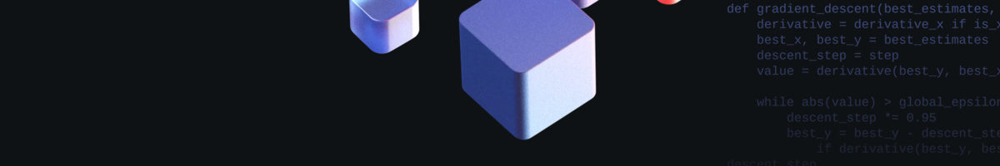

# Веб-скрапинг Wikipedia со Scrapy.



## Описание
Этот репозиторий содержит код для веб-скрапинга, написанный на Python с использованием фреймворка Scrapy. Скрипт предназначен для сбора информации о фильмах с русскоязычной версии Википедии. Данные включают название фильма, жанр, режиссера, страну производства и год выпуска.

## Функционал
1. `exclude_special_notations(data)`: Функция для исключения специальных обозначений и нежелательных символов из собранной информации.
2. `parse_film_data(response)`: Функция для извлечения и структурирования информации о фильме со страницы Википедии.
3. `FilmDataMtsShadItem`: Основной класс Spider для Scrapy, который осуществляет процесс скрапинга.

## Использование
1. Для использования скрипта потребуются Python 3.x и Scrapy 2.8.0 (либо совместимой версии).
2. Клонируйте репозиторий.
3. Запустите скрипт командой:
   ```bash
   scrapy crawl film_data -o film_data.csv
   ```
4. Собранные данные будут автоматически сохраняться в CSV-файле.